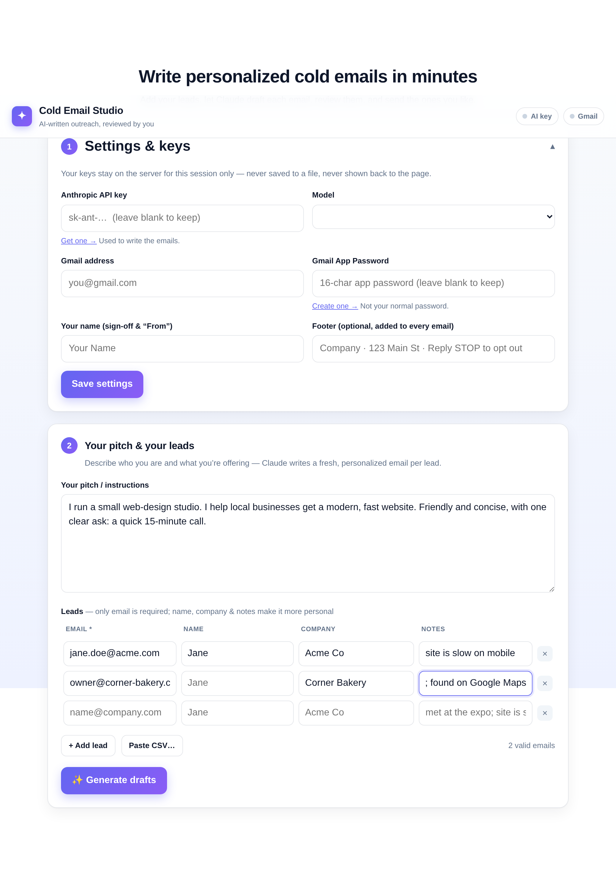

# Cold Email Studio

Write **personalized** cold emails with Claude, **review** them, and send the
ones you like from your **Gmail** — all from a clean web page. Nothing is ever
sent without your explicit approval.

You can use it two ways:

- **🌐 Website** (recommended) — `python app.py`, then open it in your browser.
- **⌨️ Command line** — `python send_emails.py` (drafts to files you approve).

Both share the same engine; pick whichever you prefer.



---

## What you need

1. **Python 3.9+**
2. An **Anthropic API key** — https://console.anthropic.com/ → API Keys
3. A **Gmail App Password** (2-minute setup, see below)

---

## Run the website

```bash
pip install -r requirements.txt
python app.py
```

Then open **http://localhost:5000** in your browser. From there:

1. **Settings** — paste your Anthropic key, Gmail address, and Gmail App
   Password. (Your keys are held in server memory for the session only — never
   written to a file, never sent back to the page.)
2. **Pitch & leads** — describe what you're offering, add your leads (type them
   in or *Paste CSV*), and click **Generate drafts**.
3. **Review & send** — edit any email, uncheck any you don't want, and hit
   **Send approved emails**.

Want it to remember *your* keys so you don't retype them? Copy `.env.example` to
`.env` and fill it in — those values pre-fill the Settings panel for you. (`.env`
is git-ignored.)

### Getting a Gmail App Password

A normal Gmail password won't work from a script — Google requires an "App
Password":

1. Turn on **2-Step Verification**: https://myaccount.google.com/security
2. Open **App Passwords**: https://myaccount.google.com/apppasswords
3. Create one and copy the 16-character code (the spaces are fine).

---

## Put it online so others can use it

Running `python app.py` only works while *your* computer is on. To give it a
public link anyone can visit, deploy it to a host. It's a standard Flask app, so
most platforms work; here's the short version for **Render** (has a free tier):

1. Push this repo to GitHub (already done if you're reading this there).
2. Create a free account at https://render.com → **New → Web Service** → connect
   this repo.
3. Render auto-detects Python. Confirm:
   - **Build command:** `pip install -r requirements.txt`
   - **Start command:** `gunicorn app:app --workers 1 --timeout 120`
     (also provided in the `Procfile`).
4. Add an environment variable **`FLASK_SECRET_KEY`** set to any long random
   string (keeps sessions stable across restarts).
5. Deploy. You'll get a `https://your-app.onrender.com` link to share.

Because everyone enters their **own** keys in Settings, visitors generate with
their own Anthropic credits and send from their own Gmail — you're not paying
for or sending on behalf of anyone else.

> Notes: the app keeps each visitor's settings in memory, so run a **single
> worker** (as above). For heavier use you'd move sessions to a shared store
> (Redis) and add real accounts — happy to help with that when you need it.

---

## Command-line version (optional)

Prefer the terminal? The same engine works as a 3-step CLI:

```bash
python send_emails.py            # 1. writes one draft per lead into drafts/
#                                  2. review drafts/, change "Approved: no" -> "yes"
python send_emails.py --send      # 3. sends only the approved drafts
python send_emails.py --status    # counts: pending / approved / sent
```

Leads come from `leads.csv` (columns: `email` required; `name`, `company`,
`notes` optional). The pitch lives in `prompt.md`.

---

## Good to know

- **Cost.** Each email is one short Claude call. `claude-opus-4-8` (default) is
  the most capable; pick **Haiku** in the model dropdown (or set
  `MODEL=claude-haiku-4-5` in `.env`) to cut cost a lot on big lists.
- **Sending limits.** Gmail caps daily sends (~500/day for free Gmail, ~2,000
  for Workspace). Send big lists in batches.
- **No double-sends (CLI).** The CLI logs sent addresses to `sent_log.csv` and
  skips them next time.

---

## Please send responsibly

Cold outreach is legal in many places **with** a few basics: email people who
plausibly want to hear from you, say who you are, honor opt-outs and replies
immediately, and include a real mailing address plus an unsubscribe line (use
the **Footer** field / `EMAIL_FOOTER`). Rules like CAN-SPAM (US), CASL (Canada),
and GDPR/PECR (EU/UK) may apply — check what's required for your audience.
